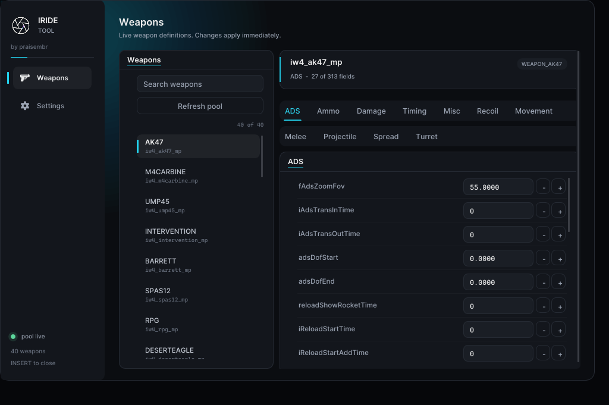
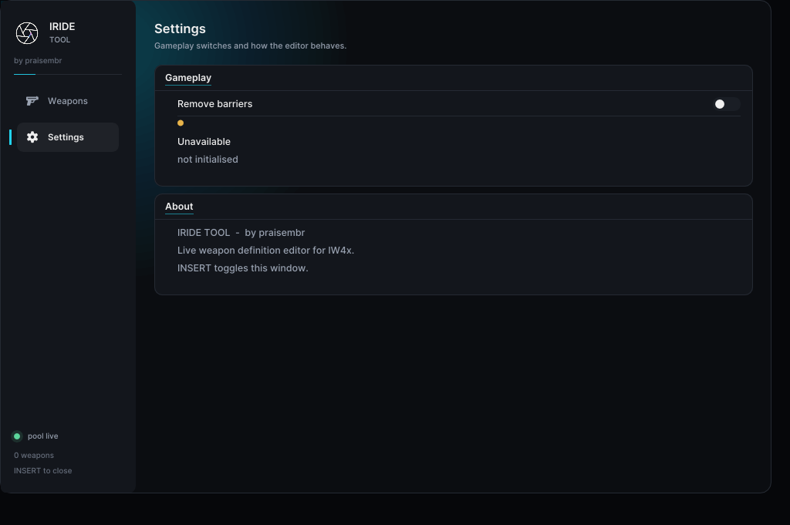

# iride

A live weapon-definition editor for **IW4x** (Call of Duty: Modern Warfare 2).

Edit weapon stats while the game is running and see the change immediately — no
map reload, no restart, no files to patch.

[**Download the latest release →**](https://github.com/emqer/iride/releases/latest)

  

## The editor

Press **INSERT** in game to open it.

Every weapon in the loaded pool, with its definition laid out by category — ADS,
ammo, damage, timing, recoil, movement and the rest. Click a value, type a new
one, press Enter — it is written straight into the running game.

## Getting started

1. Download `iride-launcher.exe` from the
   [latest release](https://github.com/emqer/iride/releases/latest)
2. Start IW4x
3. Run the launcher and press **INJECT NOW**
4. Press **INSERT** in game

Order does not matter — you can open the launcher before or after the game.

It is a single file. Nothing to install, nothing to unpack, no extra DLL to
place next to the game.

## Where it works

**Private matches and servers you host.** There, your game is the authority, so
an edit is the real value and behaves exactly as you would expect.

**Not on servers you do not host.** iride edits your own client's copy of the
weapon definitions — it has no networking of any kind. A server you connect to
keeps its own definitions and decides damage, hit registration and what
everyone else sees. Your client would predict with your numbers and get
corrected back to the server's, which produces desync, not an advantage.

Which is the honest version of a simpler point: this is a tool for messing
about with weapons in your own game. Trying to use it against other players
would be cheating, and it would not work anyway.

## Updating

The launcher checks for a new version when it starts and offers it in one
click. Updates are signed, and it refuses anything that does not verify against
the key built into it.

## Requirements

- Windows
- IW4x

## Notes

- `INSERT` toggles the editor window. Your mouse is captured while it is open,
  so clicks do not reach the game.
- Changes are live and are **not** saved. Restarting the game puts everything
  back.
- The weapon pool is rebuilt on every map load. Use **Refresh pool** after
  changing map if the list looks stale.

## Licence

iride is licensed under the [GNU General Public License v3.0](LICENSE) or
later. It uses the IW4x client's published game struct definitions, which are
GPL-3.0, so iride is GPL-3.0 too.

### Getting the source

The source is not published here, but you are entitled to it.

**Written offer:** for at least three years from the date of each release,
praisembr will give any person who possesses the `iride-launcher.exe` binary a
complete machine-readable copy of the corresponding source code for that
release, under the terms of the GPL-3.0, at no charge. To request it, open an
issue on this repository.

Third-party components bundled into the binary — Dear ImGui, MinHook and the
embedded fonts — are listed with their licences in
[THIRD-PARTY-NOTICES.txt](THIRD-PARTY-NOTICES.txt).

---

Made by **praisembr**
